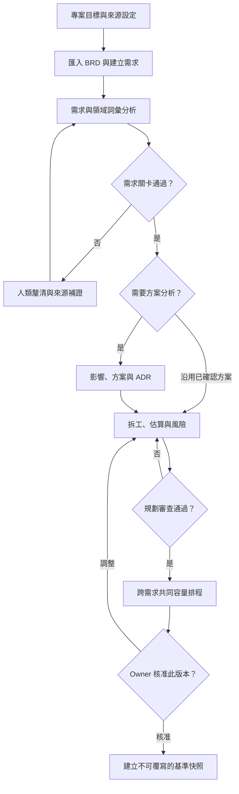
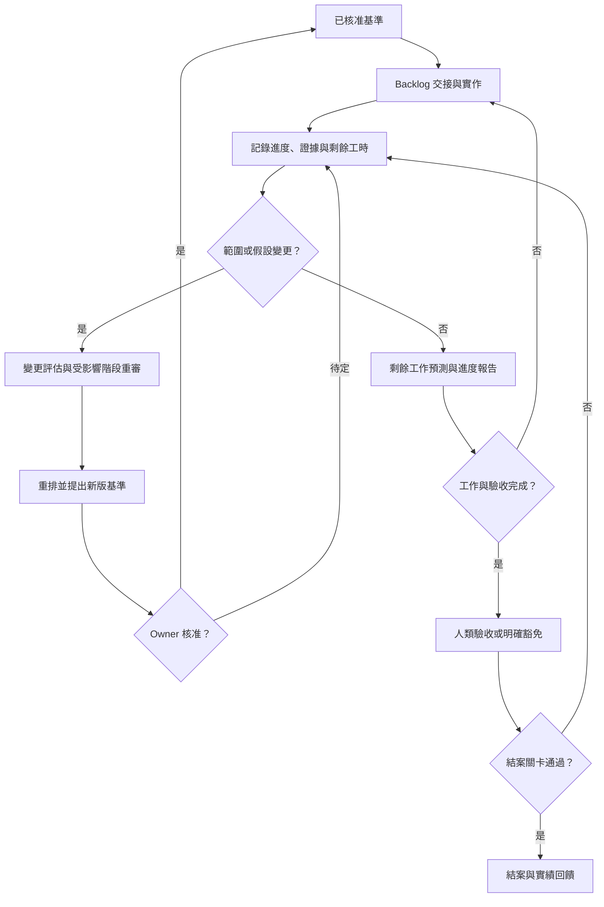

# 專案管理工作流程

本頁是日常操作入口。從 Repository 根目錄執行命令，將所有 `<...>` 換成自己的實際值；
尖括號是說明用佔位文字，不能直接貼到 shell 執行。先完成 [初始化指南](initialization-guide.zh-TW.md) 的環境設定。
Agent 先讀 `AGENTS.md`，再按需使用 [9 個 Skills](skill-catalog.md)。
一次任務可以只完成某個子步驟，不必從頭重跑全部流程。

## 流程圖：需求到可核准計畫



`risk-analysis` 持續參與各階段；`assessment-review` 負責需求、規劃、交付及結案關卡。
方案沿用仍須記錄適用性與來源，不能略過相容性或受影響消費者的檢查。

## 流程圖：執行、預測與結案



實作在 Source Repository 依其規則進行；本 Repository 保存管理紀錄與證據。
交付工作包完成、測試通過、人類接受 AC 是不同紀錄，不能彼此替代。

## 每一步的 Skill 與命令

| 步驟 | 使用的 Skill | 命令／手動操作 | 產物與完成條件 |
|---|---|---|---|
| 1. 專案初始化 | `knowledge-bootstrap` | `python scripts/init_project.py <PROJ-ID>`；編輯 config、sources、project.md 與 planning 資料 | 有目標、成功標準、scope、owner；來源可檢索，人員與淨容量有依據 |
| 2. 整理原始需求 | `requirement-analysis` | `python scripts/init_brd.py <BRD-ID> --title "<標題>"`；手動填原文、表格及 assets | 穩定 `br-...` 編號；原始 BRD 與分析分開 |
| 3. 建立評估 | `requirement-analysis` | `python scripts/init_requirement.py <REQ-ID> --source vault/intake/<BRD-ID>/brd.md` | 建立四份核心文件及 index；擷取來源版本，尚不代表分析完成 |
| 4. 詞彙釐清 | `domain-terminology` | `python scripts/terminology.py init <TERM-ID> --label "<原始詞彙>"`；`python scripts/terminology.py report` | 已有詞彙先查詢；未知詞義登錄問題，由人類補充及確認；完整命令見下文 |
| 5. 需求關卡 | `requirement-analysis`、`assessment-review` | `python scripts/validate.py --requirement <REQ-ID> --stage requirements` | Goal、actors、scope、FR、AC、BRD 涵蓋與詞彙審查完整；此時不要求 WBS 或估算 |
| 6. 必要方案分析 | `solution-assessment` | `python scripts/workflow.py --requirement <REQ-ID> --stage solution`；手動撰寫評估，重大取捨複製 ADR 模板 | `solution-assessment.md` 記錄影響、方案及理由；已有足夠方案證據時可簡化 |
| 7. 拆工與估算 | `delivery-planning`、`risk-analysis` | `python scripts/workflow.py --requirement <REQ-ID> --stage planning`；編輯 WBS、估算、風險、追蹤與計畫 | 每個 AC 有工作、測試計畫；有估算依據、負責人、技能、容量及相依 |
| 8. 規劃審查 | `assessment-review` | 先 `python scripts/validate.py --requirement <REQ-ID> --stage planning`；審查後設定 readiness，再執行 `--planning` | review metadata、assumptions 與適用阻塞均已處理；不得只因檔案存在而判定完成 |
| 9. 跨需求排程 | `delivery-planning` | `python scripts/schedule_project.py --project <PROJ-ID> --scenario expected`；另跑 `--scenario high` | project.md 選入所有共用容量的 REQ；生成情境、逐日分配及輸入 hashes |
| 10. 基準核准與保存 | `assessment-review`、`delivery-planning` | `baseline.py preview` → 人類確認 → `baseline.py create` → `baseline.py verify`，完整命令見下文 | 保存被核准的確切版本；指令不自行授予核准 |
| 11. 交接與執行 | `delivery-tracking` | `python scripts/workflow.py --requirement <REQ-ID> --stage delivery`；手動填 backlog-handoff、progress | 建立追蹤對映與交付紀錄；外部 tracker 寫入依已有授權執行 |
| 12. 觀測與預測 | `delivery-tracking`、`delivery-planning` | `python scripts/validate.py --requirement <REQ-ID> --stage delivery`；`python scripts/schedule_project.py --project <PROJ-ID> --as-of <YYYY-MM-DD> --scenario expected` | 所有選定 REQ 使用同一截止日；依明確剩餘工時預測，保留 actuals |
| 13. 變更處理 | `change-control`，按影響回到相關 Skill | 複製 `vault/templates/change-request.md` 為變更紀錄，評估後重跑受影響的關卡／排程 | 保存原基準、變更理由、決策及新版本；不是每次週報都新建基準 |
| 14. 驗收與結案 | `delivery-tracking`、`assessment-review` | `python scripts/validate.py --requirement <REQ-ID> --stage closure`；`python scripts/close_requirement.py --requirement <REQ-ID>` | 完成或有證據的取消、AC 人類接受／豁免、阻塞解除與結案決策；最後回填已量測實績 |

沒有 BRD 時可省略 `--source`，但需求與證據仍須足以支持分析。多份 BRD 可重複傳入 `--source`。
`workflow.py` 只補上缺少的文件，不覆寫內容、不改 readiness 或 status，也不代表通過任何關卡。

## 術語與來源變更

詞彙要連到受影響 FR；人類回答完成後仍須檢閱該需求的影響。以下是主要操作順序，
定義內容、確認及欄位細節見 [術語指南](domain-terminology.md)。

```bash
python scripts/terminology.py link <REQ-ID> <TERM-ID> --fr <FR-ID>
python scripts/terminology.py revision <TERM-ID>
python scripts/terminology.py confirm <TERM-ID> --revision "<sha256:版本>" --by "<確認者>" --at "<含時區的ISO時間>" --source "<明確確認來源>"
python scripts/terminology.py refresh <REQ-ID>
python scripts/terminology.py report
```

`confirm` 只記錄已取得的明確確認；Agent 不得自行填入人類未提供的定義或核准。
來源 BRD 改變時，草案用 `python scripts/refresh_brd.py --requirement <REQ-ID>` 更新快照，
重新檢視受影響 FR／AC／詞彙／方案／估算。已凍結或已結案的需求採用變更評估，保留原版本。

## 規劃審查到基準

每份需求先通過資料檢查。審查者再填寫 assessment 的 `reviewed_by`、`reviewed_at`、`assumptions`，
解決適用於目前階段的 blockers 後，將 `ready_for_planning` 設為 true。
`--stage planning` 可檢查尚未宣告 ready 的計畫；`--planning` 另外要求排程準備度。

```bash
python scripts/validate.py --requirement <REQ-ID> --stage planning
python scripts/validate.py --requirement <REQ-ID> --planning
python scripts/schedule_project.py --project <PROJ-ID> --scenario expected
python scripts/schedule_project.py --project <PROJ-ID> --scenario high
python scripts/baseline.py preview --project <PROJ-ID> --report schedule-expected.md
```

把 `preview` 輸出的 revision、指定報表及其全部輸入交由 owner 檢閱。
已取得針對該版本的核准後，記錄實際確認者、時間和來源：

```bash
python scripts/baseline.py create --project <PROJ-ID> --version <版本名稱> --report schedule-expected.md --revision "<preview輸出的sha256:版本>" --by "<確認者>" --at "<含時區的ISO時間>" --source "<核准來源>"
python scripts/baseline.py verify --project <PROJ-ID> --version <版本名稱>
```

檔案位於 `vault/projects/<PROJ-ID>/baseline/<版本名稱>/`，已存在版本拒絕覆寫。
輸入在核准後有修改就必須重算、重新 preview 並確認新版。預設只保存一份指定情境報表及其輸入；
若核准的是其他情境或 forecast，使用該 `--report` 名稱。Live progress 仍可更新，快照保持不變。

## 進度、剩餘工作與結案

開始執行前，補齊 progress 的每個 WP；記錄觀測截止日、actuals、狀態、明確估計的剩餘工作及證據。
需要時把 requirement 的資料狀態設為 `in-progress`。格式及例外規則見 [規劃與交付契約](planning-and-delivery.md)。

```bash
python scripts/validate.py --requirement <REQ-ID> --stage delivery
python scripts/schedule_project.py --project <PROJ-ID> --as-of <YYYY-MM-DD> --scenario expected
python scripts/schedule_project.py --project <PROJ-ID> --as-of <YYYY-MM-DD> --scenario high
```

截止日含當日，預測從次日開始。未知 actuals 保持未知；剩餘工時必須明確估計，不能用「原估算減已花工時」代替。
完成／取消的工作不再排程；blocked 工作須有解除日期與依據。取消前置工作不會自動滿足下游相依。
`forecast-expected.md` 與 `forecast-high.md` 位於專案資料夾，和原 `schedule-*.md` 分開。

結案前於 traceability 填寫每個 AC 的 `acceptance`，於 progress 填寫 `closure`。
接受 AC 須有通過測試及證據；無法滿足原 AC 時須有人類明確豁免及理由，不得把測試改成 passed。
全部關卡通過後，`close_requirement.py` 才把需求狀態設為 closed。

## 階段、文件與舊版遷移

| `workflow.py --stage`：建立文件 | 新增內容 |
|---|---|
| `intake` | requirement、evidence、assessment、traceability，加上 index |
| `solution` | solution-assessment；僅在需要分析方案時建立 |
| `planning` | work-breakdown、estimation、risks、project-plan、assessment-review |
| `delivery` | 規劃文件，加上 progress、backlog-handoff |

`validate.py --stage` 使用另一組**關卡**名稱：`intake`、`requirements`、`planning`、`delivery`、`closure`。
實際檢查至少到指定關卡，並以現有狀態／ready flag 的較高要求為準；不能用 intake 參數繞過 closed 的結案檢查。

升級既有需求時，保留舊分析、ADR、ID、引用及已核准資料；按需用 workflow 補檔即可。
舊 Skill 名稱改用 [對照表](skill-catalog.md)；舊敘述文件仍可當證據，不要求全部重寫。
`python scripts/schedule.py --requirement <REQ-ID> --scenario expected` 仍可做單一需求的完整工作情境，
但它不處理其他 REQ 的競爭，也不做剩餘工作預測。同一資源池的工作應納入同一份專案排程。

最後執行 `python scripts/validate.py --all`；工具變更另跑 `python -m unittest discover -s tests -v`。
[資料契約](data-contract.md) · [規劃與交付契約](planning-and-delivery.md) · [Skill 目錄](skill-catalog.md) · [回到目錄](index.md)
